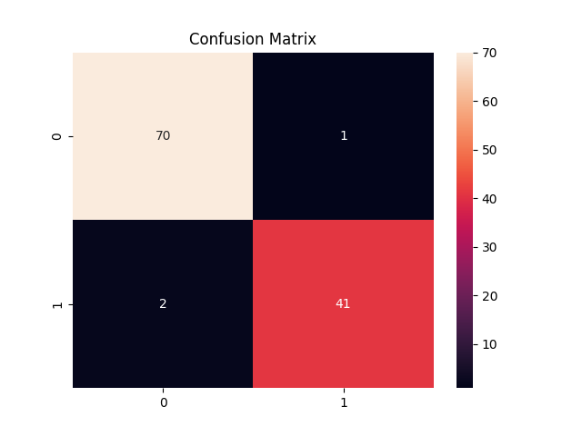

Task 4

# 🧠 Logistic Regression: Breast Cancer Classification

This project is part of the AI & ML Internship (Task 4) and involves building a binary classification model using *Logistic Regression* to detect whether a tumor is *malignant (cancerous)* or *benign (non-cancerous)* using the Breast Cancer Wisconsin Dataset.

---

## 📌 Objective

To develop a logistic regression model that classifies tumors based on various medical features into *malignant (M)* or *benign (B)* classes.  
The goal is to understand the logistic regression process and evaluate model performance using key classification metrics.

---

## 📂 Dataset Information

- *Name:* Breast Cancer Wisconsin (Diagnostic) Data Set  
- *Source:* [Kaggle Dataset Link](https://www.kaggle.com/datasets/uciml/breast-cancer-wisconsin-data)  
- *Rows:* 569  
- *Features:* 30 numeric medical features (mean, standard error, worst values)  
- *Target:* diagnosis (M = Malignant, B = Benign)

---

## 🧰 Tools and Libraries Used

- Python
- Pandas
- NumPy
- Matplotlib
- Seaborn
- Scikit-learn

---

## 🔍 Methodology

1. *Data Preprocessing*
   - Dropped unnecessary columns like id and Unnamed: 32
   - Converted target diagnosis to binary:
     - M → 1 (Malignant)
     - B → 0 (Benign)

2. *Train-Test Split*
   - 80% for training, 20% for testing using train_test_split

3. *Feature Scaling*
   - Used StandardScaler for standardization

4. *Model Training*
   - Trained logistic regression model on scaled features

5. *Model Evaluation*
   - Confusion Matrix
   - Classification Report (Precision, Recall, F1)
   - ROC-AUC Score
   - ROC Curve

---

## 📈 Model Evaluation & Confusion Matrix

### 🔹 Confusion Matrix visualization saved in the repo.

### 🔹 Explanation

| Metric               | Value    |
|----------------------|----------|
| Accuracy             | 97.4%    |
| Precision (Malignant)| 97.6%    |
| Recall (Malignant)   | 95.3%    |
| F1 Score             | 96.4%    |

- ✅ The model correctly classified *111 out of 114* test samples.
- 🧠 *False Negatives = 2* (critical in medical use-case)
- 🔍 High precision ensures few false positives; high recall ensures few false negatives.

> 🖼 If you're viewing this on GitHub, you can see the image below:

---

## 🔗 Submission Details

- *Submitted by:* Ujjwal Mishra  
- *GitHub Repository:* https://github.com/Ujjwal-Asta/Logistic_Regression_BreastCancer  
- *Internship Program:* Elevate Labs – AI & ML Internship (Task 4)

---

> 🔥 "Early diagnosis saves lives — use data to make a difference." 🔥
